<div align="center">

# 🧊 OpenMCU Cube

### An STM32CubeMX-style configurator for **HK32** & **PY32** microcontrollers

<p align="center">
  <a href="https://mrz-ir.github.io/OpenMCU-Cube/OpenMCU_Cube.html" target="_blank">
    
  </a>
</p>

**Pinout · Clock tree · Code generation — in a single offline HTML file.**

[](OpenMCU_Cube.html)
[](LICENSE)
[](#-getting-started)
[](#-getting-started)
[](https://github.com/mrz-ir/OpenMCU-Cube)

*Unofficial, unaffiliated tool — not affiliated with Puya Semiconductor or Hangshun (HK).*

</div>

---

## 📑 Table of contents

- [✨ Features](#-features)
- [🎨 Four themes](#-four-themes)
- [🖥 Workflow](#-workflow)
- [🎛 Supported devices](#-supported-devices)
- [🚀 Getting started](#-getting-started)
- [📖 Usage guide](#-usage-guide)
- [🗂 Repository layout](#-repository-layout)
- [🛠 Development](#-development)
- [🤝 Contributing](#-contributing)
- [🔒 Security](#-security)
- [⚠️ Disclaimer](#️-disclaimer)
- [📄 License](#-license)

---

## ✨ Features

| | |
|---|---|
| 🧩 **Pinout & Configuration** | Interactive package view with click-to-configure pins: GPIO input/output, alternate functions, analog roles, conflict detection and suggested-pin highlighting. **Scroll to zoom (anchored at the mouse cursor), drag to pan, 100% reset** — inspect any pin on dense packages. |
| ⏱ **Clock Configuration** | Enable HSI / HSE / LSI / LSE / PLL, choose the SYSCLK source and AHB/APB prescalers, with a **live block diagram** that highlights the active path and warns when a limit is exceeded. |
| 🕐 **Timer Waveform Designer** | Time-based signal preview of every assigned channel (incl. complementary outputs), graphic PSC/ARR/per-channel-Pulse editing, **target frequency/period auto-compute**, and **dead-time (ns ⇄ DTG)** for advanced timers. PSC / ARR / Pulse are edited right inside the designer, keeping the timer cards clean. |
| ⚡ **Interrupts & EXTI** | Enable **interrupts** on timers / UART / ADC and **external interrupts (EXTI)** on any pin — NVIC setup and IRQ handlers are generated per chip, and an **Interrupt Priorities** panel lets you order the enabled interrupts (drag & drop) for the generated NVIC configuration. |
| 🛡 **Validation & export safety** | Centralized validation gate rejects invalid clock/timer/peripheral/UART configurations before export; machine-readable `OpenMCUValidation()` API. |
| 📟 **Code Generation** | HAL-style code for PY32 devices, StdPeriph-style code for HK devices. Download `main.c` or a full ZIP (drivers + startup + **ready-to-open Keil uVision project**) — an **Output Settings** dialog picks exactly which files go into the ZIP. |
| ↩️ **Undo / Redo** | `Ctrl+Z` / `Ctrl+Y` plus toolbar buttons, with one-click **Clear Pins** and **Reset Peripherals** from the header. |
| 🎛 **Smart pickers** | Device-selection modal with brand/family filters and live search; peripheral list with search box and group filter chips. |
| 🔄 **Project restore** | Upload a previous `main.c` to keep your `USER CODE` blocks, or add `project_settings.json` to restore pins, peripherals, clock settings and the project name. |
| 🎨 **Four themes** | **Dark**, **Light**, **Midnight** and **Paper** — theme picker in the header, remembered between sessions. |
| 📱 **Responsive** | Works on phones, tablets and desktops. |
| 🔌 **Zero dependencies** | A single `.html` file that runs fully offline in any modern browser. |

---

## 🎨 Four themes

The same Clock Configuration view (HK32F103 with HSE + PLL → SYSCLK = PLL) in all four
built-in themes. Pick one with the palette button 🎨 in the header — your choice is
remembered between sessions.

| Dark | Light |
|------|-------|
| 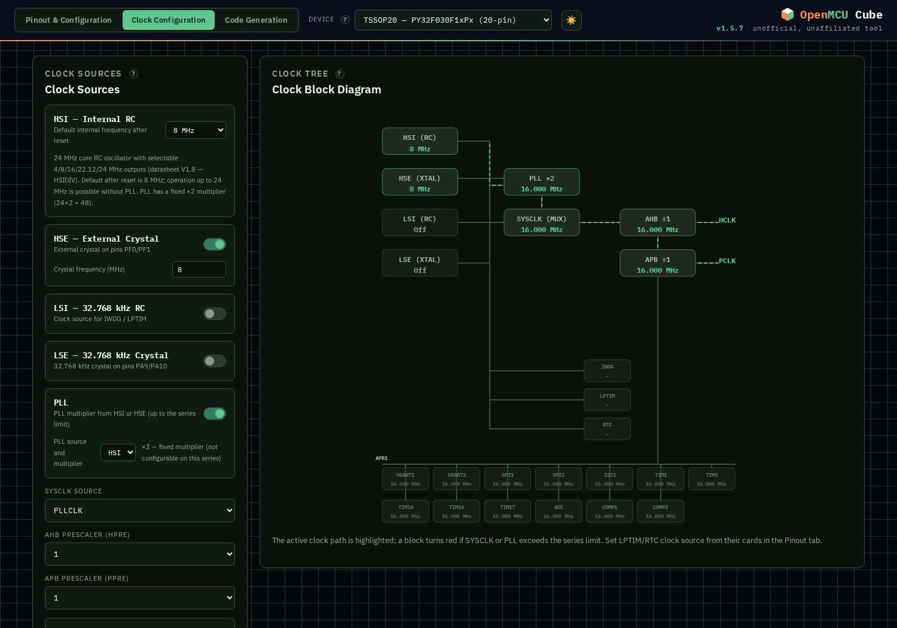 | 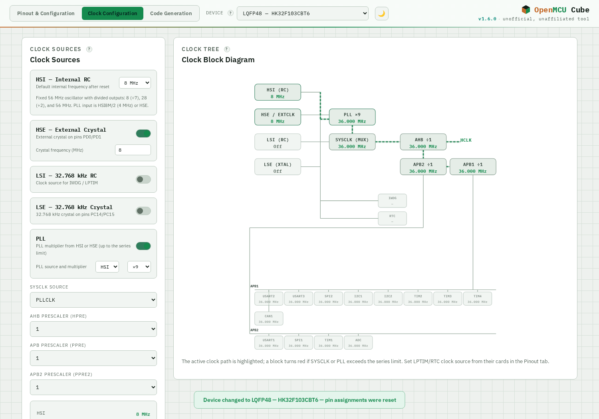 |

| Midnight | Paper |
|----------|-------|
| 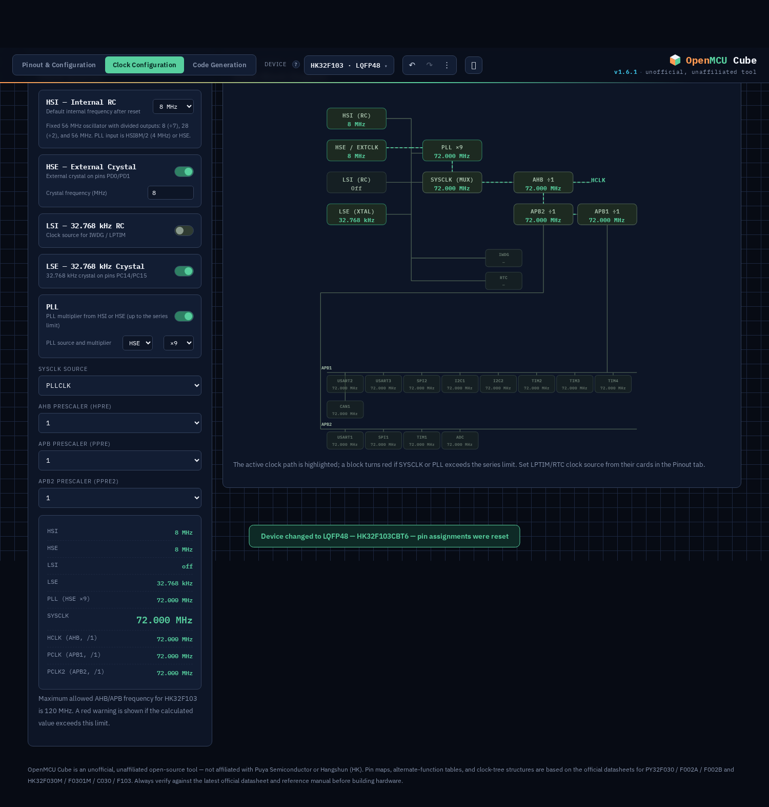 | 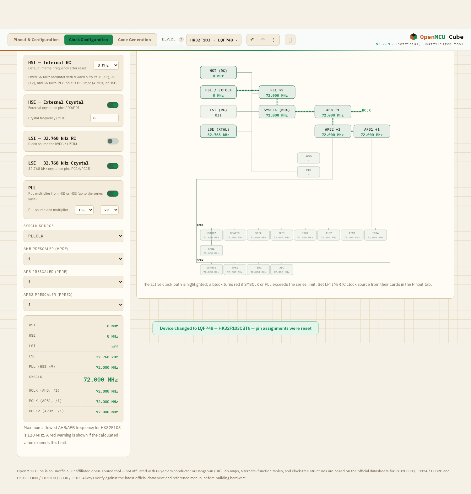 |

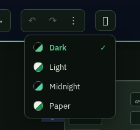

---

## 🖥 Workflow

### Zoom & pan the package view
Scroll over the chip diagram to zoom — the view zooms **toward the mouse cursor** — then
click and drag to pan around the package. The **100%** button resets and re-centers the
view.

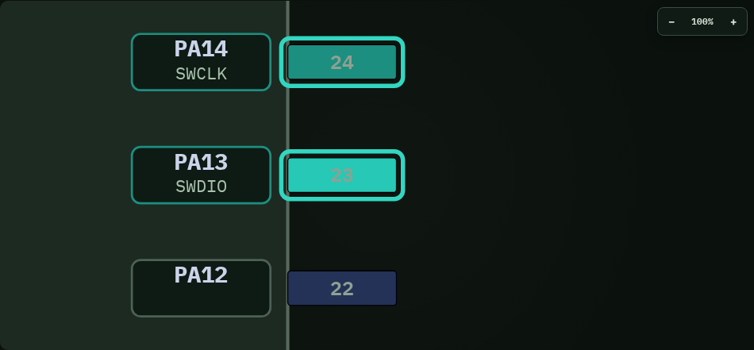

### Undo / Redo & history actions
`Ctrl+Z` / `Ctrl+Y` undo and redo your pin/peripheral/clock edits; the ⋮ menu in the
header gives you one-click **Clear Pins** and **Reset Peripherals**.

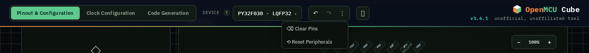

### Choose exactly what goes into the ZIP
The **Output Settings** dialog controls what “Download all files (ZIP)” produces:
`main.c`, the Keil uVision project (`.uvprojx` / `.uvoptx`), the SDK libraries
(`Drivers/`), `project_settings.json` and `README.txt` — at least one item must stay
enabled.

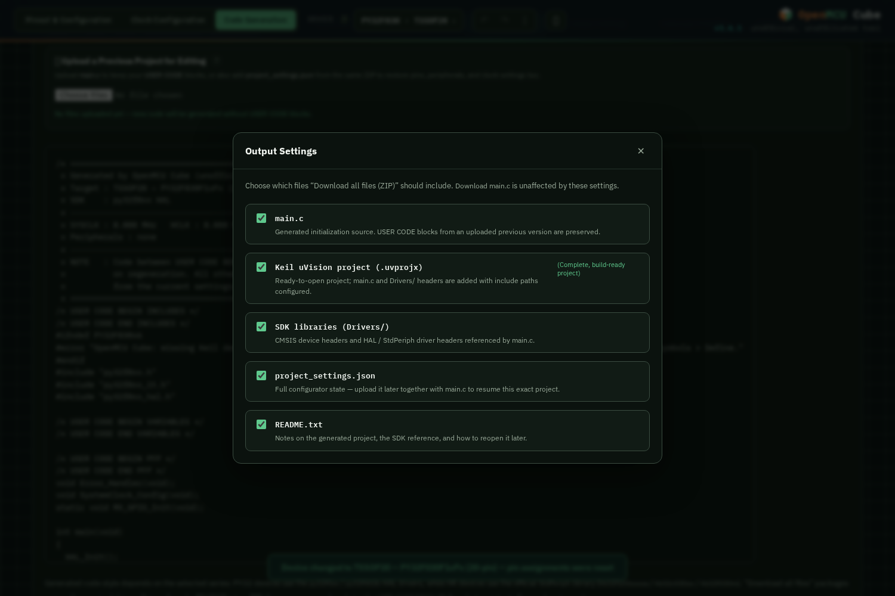

### Designer previews
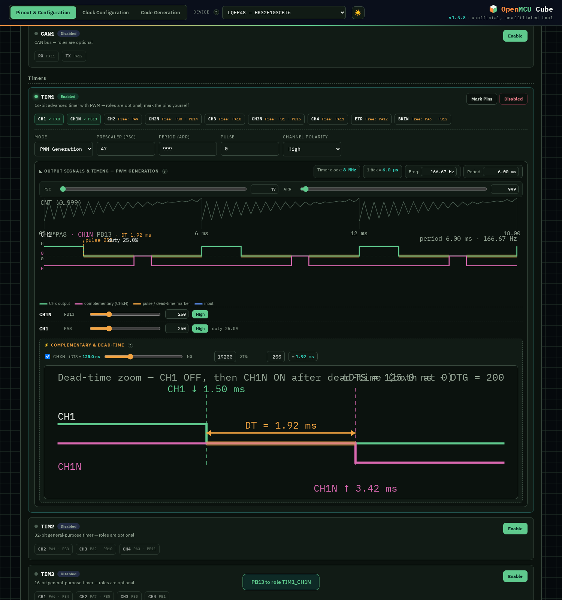

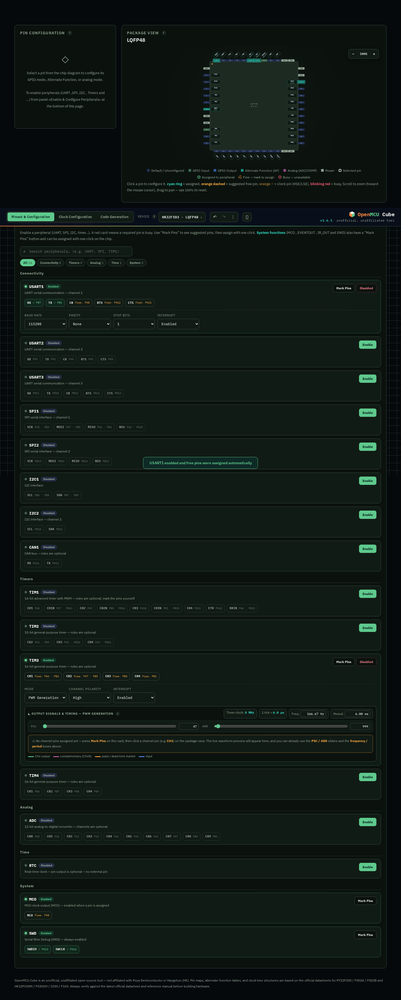  ·  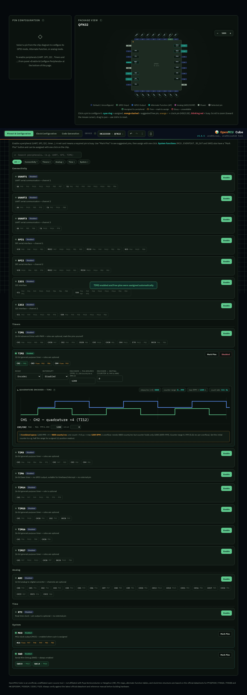

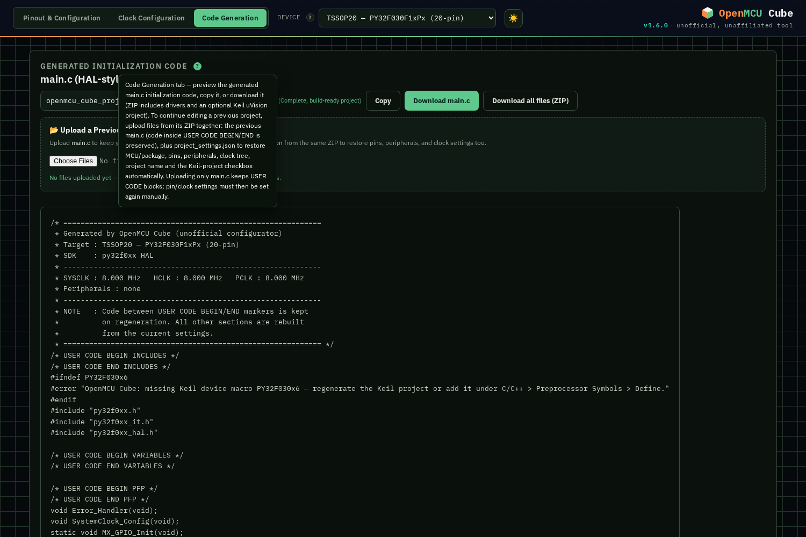

---

## 🎛 Supported devices

| Family | Packages | Core clock limit |
|--------|----------|------------------|
| **PY32F030** (Puya) | TSSOP20, QFN20, LQFP32 | 48 MHz |
| **PY32F002A** (Puya) | QFN16 | 24 MHz |
| **PY32F002B** (Puya) | QFN20, TSSOP20, SOP14 | 24 MHz |
| **HK32F030M** (Hangshun) | TSSOP20, QFN20 | 32 MHz |
| **HK32F0301M** (Hangshun) | TSSOP20, QFN20, … | 48 MHz |
| **HK32C030** (Hangshun) | QFN32, … | 64 MHz |
| **HK32F103** (Hangshun) | LQFP48 | 120 MHz |

Generated code targets the matching vendor SDK for each family:
**PY32F0xx / PY32F002B HAL** drivers, or the official **HK32 StdPeriph** libraries
(`hk32f103xxxxa` / `hk32c030xx` / `hk32f030m`).

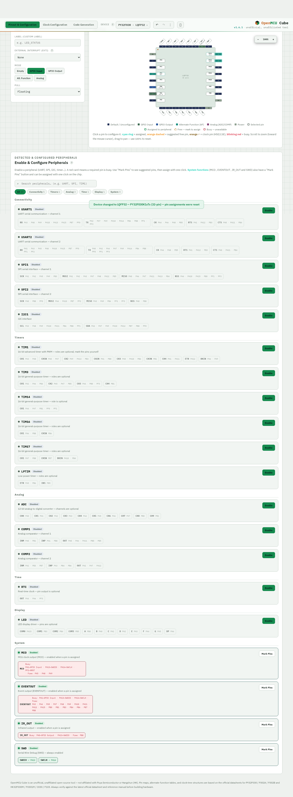

---

## 🚀 Getting started

1. **Download** [`OpenMCU_Cube.html`](OpenMCU_Cube.html) (or the latest release from the [Releases](https://github.com/mrz-ir/OpenMCU-Cube/releases) page).
2. **Double-click it** — it opens in your browser. No installation, no internet connection needed.
3. Pick your **Device** in the top bar, configure **pins → clocks**, then generate **code**.

> 💡 **Tip:** enable **GitHub Pages** on the repository (Settings → Pages → branch `main`) and the app is also usable online at
> `https://mrz-ir.github.io/OpenMCU-Cube/OpenMCU_Cube.html`.

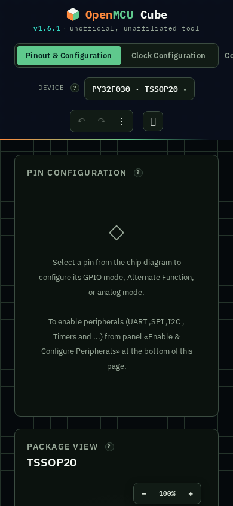

---

## 📖 Usage guide

### Tab 1 — Pinout & Configuration
- Click any **pin** on the package drawing to select it — **scroll to zoom toward the mouse cursor**, **drag to pan**, and use the **100%** button to re-center.
- Configure its **mode** (GPIO Input / Output / Alt. Function / Analog), pull, output type, or the specific **alternate function**.
- **Ring legend:** <span style="color:#33d6c0">● cyan</span> = assigned · <span style="color:#f2a341">⭘ orange dashed</span> = suggested free pin · <span style="color:#8a6a2a">⚡ amber</span> = clock pin (HSE/LSE) · <span style="color:#e2596b">● blinking red</span> = busy/conflicted.
- In **Enable & Configure Peripherals**, enable a peripheral (USART, SPI, I2C, timers, ADC, CAN…), press **Mark Pins** to see suggested pins, then assign them with one click. Use the **search box / group chips** above the list to find a peripheral quickly.
- Pick the MCU in the top bar — the **device picker** modal offers brand/family filters and live search.
- **Undo / Redo** (`Ctrl+Z` / `Ctrl+Y`) and one-click **Clear Pins** / **Reset Peripherals** live in the header.

### Tab 2 — Clock Configuration
- Toggle the oscillators (**HSI / HSE / LSI / LSE / PLL**) and set crystal frequencies.
- Choose the **SYSCLK source** and the **AHB / APB prescalers**.
- The computed clock list and the block diagram update live — a block turns **red** when a value exceeds the series limit.

### Interrupts & EXTI
- Open a **timer / UART / ADC** card and set **Interrupt → Enabled** — the code gets NVIC enable (`MX_IRQ_Init`) and the IRQ handler appears in `_it.c` with a `USER CODE` block.
- Select a **GPIO pin** and choose **External interrupt (EXTI)** (Rising / Falling / Both) — `MX_EXTI_Init` and the `EXTIx_IRQHandler` are generated.
- On the **Code Generation** tab, the **⚡ Interrupt Priorities** panel lists every enabled interrupt — drag to reorder (top = highest priority); the order feeds the generated `HAL_NVIC_SetPriority` / `NVIC_InitStructure` and is saved with the project.

### Timer Waveform Designer (in the Pinout & Configuration tab)
- Enable a timer (e.g. TIM1, TIM3) and assign its channel pins — a **waveform section** appears inside the timer card.
- **PSC / ARR** sliders and boxes, and a **per-channel Pulse** slider + High/Low polarity. PSC / ARR / Pulse are edited only here (with their own sliders + number boxes), so the timer card stays clean.
- The **Frequency / Period** boxes show the current value; type a target (e.g. `20k`, `100us`) and press **Enter** to auto-compute PSC/ARR.
- **Advanced timers** (e.g. TIM1) show **Complementary & Dead-time**: enable CHxN, set dead-time in **ns ⇄ DTG** with a live zoomed edge view.
- **Encoder mode** has dedicated controls: pulses/rev (PPR), initial counter, steps/rev, counter range and max RPM.

### Tab 3 — Code Generation
- Review the generated `main.c`, then **Copy**, **Download main.c**, or **Download all files (ZIP)**.
- The **Output Settings** dialog chooses exactly which files go into the ZIP: `main.c`, the Keil project (`.uvprojx` / `.uvoptx`), SDK libraries (`Drivers/`), `project_settings.json` and `README.txt`.
- The ZIP includes the driver sources/headers, a startup file and an optional **Keil uVision `.uvprojx`** project with include paths pre-configured.
- **Keep your custom code inside `USER CODE BEGIN/END`** so it survives regeneration.

### Continuing a previous project
1. Open the **Code Generation** tab and select files from the previous project's ZIP *together*:
   - the previous `main.c` (your `USER CODE` blocks are detected and preserved), and
   - `project_settings.json` (restores MCU/package, pins, peripherals, clock tree and project name).
2. Everything is applied to the UI automatically — continue where you left off.

---

## 🗂 Repository layout

```
OpenMCU_Cube.html   ← the entire application (single self-contained file)
docs/                    ← screenshots used in this README
LICENSE                  ← MIT license
CHANGELOG.md             ← version history (maintained from v1.5.7 on)
RELEASE_NOTES_1_6_1.md   ← release notes for the GitHub Releases page
CONTRIBUTING.md          ← how to contribute
SECURITY.md              ← how to report vulnerabilities
DEVELOPER_GUIDE.md       ← developer guide for adding new chips (FA)
DEVELOPER_GUIDE_EN.md    ← developer guide (EN)
```

---

## 🛠 Development

The whole application is **one self-contained HTML file** (HTML + CSS + JavaScript, including the embedded vendor SDK payloads). Working on it is intentionally simple:

1. Open `OpenMCU_Cube.html` in any text editor.
2. Edit, then refresh the browser tab to test — no build step.
3. Before committing:
   - bump the version (badge in the top bar, document title, generated-code headers);
   - add a `CHANGELOG.md` entry;
   - re-test the **Clock Configuration** diagram across all supported devices.

See [CONTRIBUTING.md](CONTRIBUTING.md) for details.

---

## 🤝 Contributing

Contributions are welcome! Please read [CONTRIBUTING.md](CONTRIBUTING.md) first — it covers how to open issues, submit pull requests, and where the device databases live inside the file. To add a new chip family, see [DEVELOPER_GUIDE.md](DEVELOPER_GUIDE.md).

---

## 🔒 Security

Found a bug that could break a project or compromise a device? Please report it responsibly — see [SECURITY.md](SECURITY.md).

---

## ⚠️ Disclaimer

OpenMCU Cube is an **unofficial, unaffiliated open-source tool**. It is not endorsed by or connected with **Puya Semiconductor** or **Hangshun Microelectronics (HK)**.

Pin maps, alternate-function (AF) tables and clock-tree structures are based on the official datasheets for **PY32F030 / PY32F002A / PY32F002B** (Puya) and **HK32F030M / HK32F0301M / HK32C030 / HK32F103** (Hangshun). They are provided for convenience only — **always verify against the latest official datasheet and reference manual of your exact chip** before manufacturing or releasing firmware.

---

## 📄 License

[MIT](LICENSE) © 2026 MRZelec — OpenMCU Cube contributors
